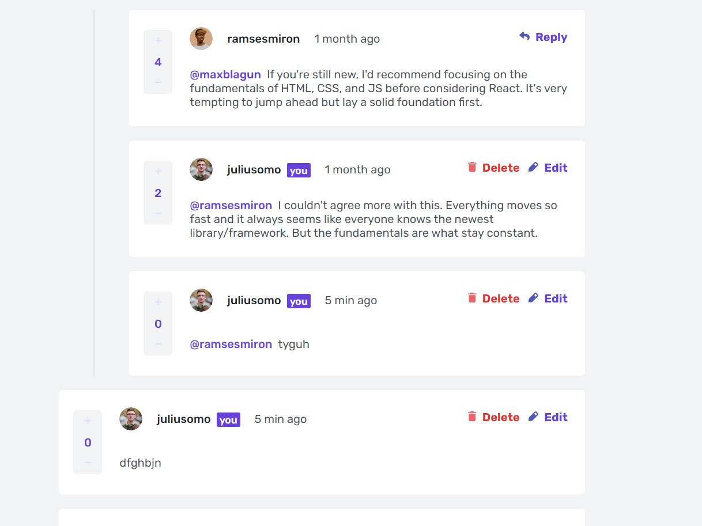

# Frontend Mentor - Interactive comments section solution

This is a solution to the [Interactive comments section challenge on Frontend Mentor](https://www.frontendmentor.io/challenges/interactive-comments-section-iG1RugEG9). Frontend Mentor challenges help you improve your coding skills by building realistic projects. 

## Table of contents

- [Overview](#overview)
  - [The challenge](#the-challenge)
  - [Screenshot](#screenshot)
  - [Links](#links)
- [My process](#my-process)
  - [Built with](#built-with)
  - [What I learned](#what-i-learned)
  - [Continued development](#continued-development)
  - [Useful resources](#useful-resources)
- [Author](#author)

## Overview

### The challenge

Users should be able to:

- View the optimal layout for the app depending on their device's screen size
- See hover states for all interactive elements on the page
- Create, Read, Update, and Delete comments and replies
- Upvote and downvote comments
- **Bonus**: If you're building a purely front-end project, use `localStorage` to save the current state in the browser that persists when the browser is refreshed.
- **Bonus**: Instead of using the `createdAt` strings from the `data.json` file, try using timestamps and dynamically track the time since the comment or reply was posted.

### Screenshot



### Links

- Solution URL: [GitHub](https://github.com/Shcracoziabra/interactive-comments-section)
- Live Site URL: [Netlify](https://shcraco-comments-section.netlify.app)

## My process

The following requirements are fulfilled:

- First-level comments are ordered by their score, whereas nested replies are ordered by time added.
- Replying to a comment adds the new reply to the bottom of the nested replies within that comment.
- A confirmation modal pops up before a comment or reply is deleted.
- Adding a new comment or reply uses the `currentUser` object from within the `data.json` file.
- You can only edit or delete your own comments and replies.

### Built with

- Semantic HTML5 markup
- CSS custom properties
- [Open Props](https://open-props.style/) - sub-atomic styles
- Flexbox
- CSS Grid
- [React](https://react.dev/) - JS library

### What I learned

- made use of React hooks useState, useEffect, useRef, useCallback, useContext
- learned to use Open-props CSS variables to match the design needed
- worked with JS Date object methods and props to create custom time strings for comments created and edited timestamps
- checked page accessibility with the Chrome Screen reader for sighted users and for those, who uses keyboard
- worked with Local Storage to emulate CRUD operations
- wrote reducer function for the useReducer React hook to manipulate heavy state
- learned how to use several image types for optimization, if browser supports the type. the example html is below.

```html
  <picture>
    <source srcset="photo.avif" type="image/avif" />
    <source srcset="photo.webp" type="image/webp" />
    
  </picture>
```

### Continued development

I want to explore React hooks: useEffect, useLayoutEffect, useRef, useImperativeHandle.
In addition, learn deeper and recap React component's lifecycle and on what stages different hooks run.

### Useful resources

- [React library](https://react.dev) - This page contains tutorials and references to the React concepts.
- [Open Props](https://open-props.style/) - Open props page has lots of exapmles of using its CSS variables. Open Props includes Open Color, an open-source color scheme optimized for UI development.
- [Freecodecamp Article](https://www.freecodecamp.org/news/understand-call-apply-and-bind-in-javascript-with-examples/) - How to Use the Call, Apply, and Bind Functions in JavaScript – with Code Examples.
- [How to cancel React Modal](https://keyholesoftware.com/cancel-a-react-modal-with-escape-key-or-external-click/) - Tells how to cancel a React modal with Escape Key or external click
- [MDN article](https://developer.mozilla.org/en-US/docs/Web/API/HTMLInputElement/selectionStart) - explores selectionStart and selectionEnd property, needed to set the mouse cursor in a certain place of the text.

## Author

- GitHub - [Tetiana B.](https://github.com/Shcracoziabra)
- Frontend Mentor - [@Shcracoziabra](https://www.frontendmentor.io/profile/Shcracoziabra)
